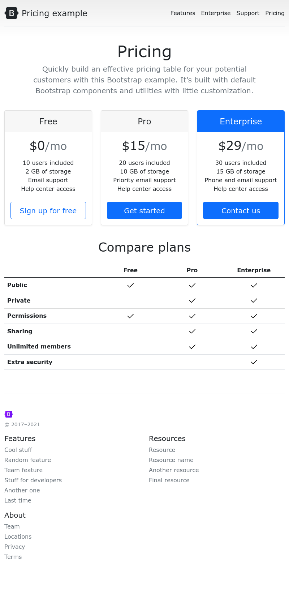

# **Задание: Страница тарифов на React-Bootstrap**

## **Описание**
Ты создашь проект, в котором напишешь код веб-страницы с использованием React-Bootstrap по картинке Template.png

---

## **Цели задания**

Реализовать компоненты сайта c помощью компонентов React-Bootstrap (в скобочках элементы из React-Bootstrap, которые надо будет задействовать):
1. NavigationBar — верхнее меню (\<Navbar\> и \<Nav\>).
2. Header — заголовок и подзаголовок.
3. PricingCards — три карточки с тарифами (\<Row\>, \<Col\>, \<Card\>, \<Button\>, \<ListGroup\>).
4. ComparePlansTable — таблица сравнения тарифов (\<Table\>).
5. Footer — подвал страницы (\<Row\>, \<Col\>).

## **Что стоит прочитать перед началом**
**1. Компоненты Bootstrap**
Bootstrap предоставляет множество готовых UI-компонентов, таких как кнопки, карточки, навигационные панели и таблицы.

**Основные компоненты**:
- [Navbar](https://react-bootstrap.netlify.app/docs/components/navbar/) – навигационная панель.
- [Card](https://react-bootstrap.netlify.app/docs/components/cards/) – карточки для отображения контента.
- [Button](https://react-bootstrap.netlify.app/docs/components/buttons/) – кнопки с разными стилями.
- [ListGroup](https://react-bootstrap.netlify.app/docs/components/list-group/) – списки элементов.
- [Table](https://react-bootstrap.netlify.app/docs/components/table/) – таблицы для отображения данных.

**2. Сетка (Grid System)**
Грид-система Bootstrap основана на **12-колоночной адаптивной структуре** и позволяет легко создавать гибкие макеты.
**Основные элементы сетки**:
- `Container` – контейнер для центрирования контента.
- `Row` – строка, в которой размещаются колонки.
- `Col` – колонка, которая может занимать разное количество пространства.

 [Документация по сетке Bootstrap](https://react-bootstrap.netlify.app/docs/layout/grid)

**3. Утилитарные классы (Utility Classes)**
Утилитарные классы позволяют быстро добавлять стили без написания CSS. Они помогают управлять отступами, текстом, границами, цветами и другими свойствами.

**Основные утилиты**:
- [Отступы (Spacing)](https://getbootstrap.com/docs/5.0/utilities/spacing/) – `m` (margin) и `p` (padding).
- [Границы (Borders)](https://getbootstrap.com/docs/5.0/utilities/borders/) – `border`, `rounded`, `shadow`.
- [Фон и цвета (Background & Colors)](https://getbootstrap.com/docs/5.0/utilities/colors/) – `bg-primary`, `text-white`.
- [Текстовые утилиты (Typography)](https://getbootstrap.com/docs/5.0/utilities/text/) – `text-center`, `text-uppercase`.
- [Тени (Shadows)](https://getbootstrap.com/docs/5.0/utilities/shadows/) – `shadow-sm`, `shadow-lg`.
- [Отображение (Display)](https://getbootstrap.com/docs/5.0/utilities/display/) – `d-none`, `d-flex`.

---

## **Важно!**
Мне не нужен pixel perfect в этом задании, достаточно будет понять основную идею, попробовать компоненты и утилиты, чтобы на выходе получить приблизительно (не обязательно идеально) схожий результат.
